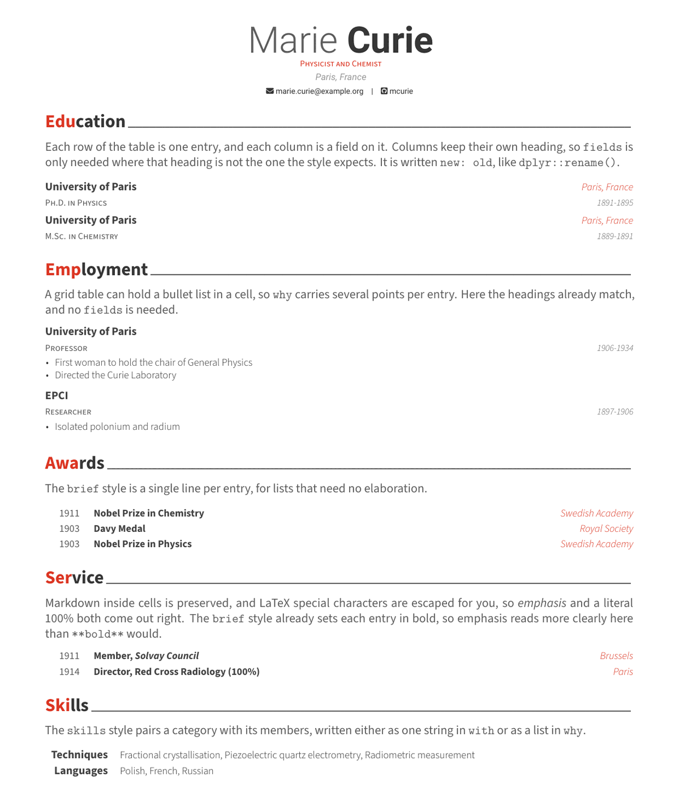
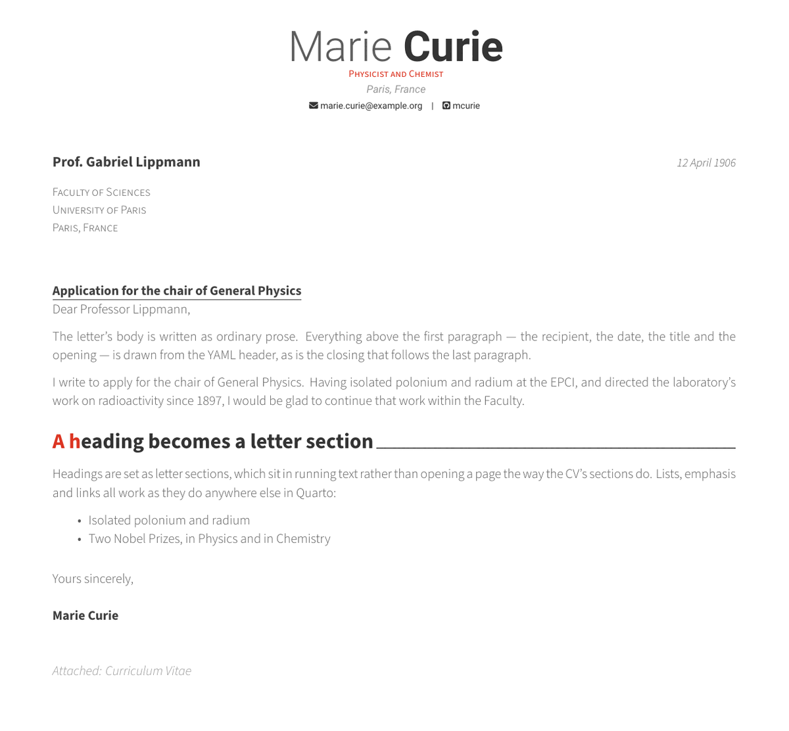

# Awesome CV

A Quarto format for writing a CV, and a matching cover letter, with
[Awesome-CV](https://github.com/posquit0/Awesome-CV), a widely used LaTeX
template by Byungjin (Claud) Park. CV entries are written as tables, either by
hand or generated by code.

<table>
<tr>
<td width="320"></td>
<td><code>format: awesomecv-pdf</code><br>The CV: a header of contacts and profiles over sections built from <code>.entries</code> tables, in the <code>detailed</code>, <code>brief</code> and <code>skills</code> styles.</td>
</tr>
<tr>
<td></td>
<td><code>format: awesomecv-pdf+letter</code><br>A matching cover letter under the same header and footer, addressed to a recipient and written as prose. See <a href="#cover-letters">Cover letters</a> below.</td>
</tr>
</table>

## Installing

```bash
quarto use template quarto-vitae/awesome-cv
```

This installs the extension and creates a starting `template.qmd`, alongside
`coverletter.qmd` for the [cover letter format](#cover-letters). To add the
formats to a document you already have, use `quarto add quarto-vitae/awesome-cv`.

Rendering needs a LaTeX installation with **xelatex**. If you have no LaTeX,
`quarto install tinytex` will do; the fonts are fetched on the first render.

## Using

Set the format and describe yourself in the YAML header:

```yaml
---
name: Marie
surname: Curie
position: "Physicist and Chemist"
address: "Paris, France"
email: "marie.curie@example.org"
github: mcurie
format: awesomecv-pdf
---
```

Write each section as a heading, and each listing as a table inside an
`.entries` div. One row becomes one entry, and one column becomes one field on
it, named by its heading:

```markdown
# Education

::: {.entries style="detailed"}
| what             | with                | when      | where         |
|------------------|---------------------|-----------|---------------|
| Ph.D. in Physics | University of Paris | 1891-1895 | Paris, France |
:::
```

Where your data uses different headings, rename them with `fields`, written
`new: old` in the manner of `dplyr::rename()`:

```markdown
::: {.entries style="detailed" fields="{what: Degree, with: Institution, when: Years}"}
```

Markdown inside table cells is preserved, so `**bold**`, `*italic*` and links
all work. LaTeX special characters are escaped for you exactly once, so a
literal `100%` needs no backslash.

### Entries from code

More often the data lives in a data frame, and the same options are given as
cell options. The cell prints a table and the filter picks it up:

````markdown
```{r}
#| echo: false
#| vitae:
#|   style: detailed
#|   fields:
#|     what: degree
#|     with: institution
#|     when: years
education |> filter(completed)
```
````

Entries can also come from a CSV printed by a cell, from several tables in one
div, or carry bullet lists written in grid table cells. Those are covered in the
[vitae documentation](https://quarto-vitae.github.io/).

## Styles

This format implements the three conventional vitae listing styles.

`detailed`
: A multi-line entry using `what`, `with`, `where` and `when`, with a bulleted
  elaboration built from `why`. Suits education and employment. This is the
  style used when none is given.

`brief`
: A single line per entry, from `what`, `when` and a short `where` (falling back
  to `with`). Suits awards, memberships and service. `what` is set in bold, so
  use `*emphasis*` rather than `**bold**` to pick out part of it.

`skills`
: A category in `what` paired with its members, given either as one string in
  `with` or as a list in `why`.

## Format options

Set these in the YAML header. All are optional except `name`.

### Header contents

| Option | Effect |
|--------|--------|
| `name`, `surname` | The name shown in the header |
| `position` | A line of roles under the name |
| `address` | Postal address |
| `pronouns` | Displayed beside the contact details |
| `phone`, `email`, `www` | Contact details |
| `whatsapp`, `telegram`, `skype` | Messaging profiles |
| `dateofbirth` | Date of birth |
| `orcid`, `googlescholar`, `researchgate` | Academic profiles |
| `github`, `gitlab`, `bitbucket`, `stackoverflow` | Code profiles |
| `linkedin`, `twitter`, `x`, `mastodon`, `xing` | Social profiles |
| `reddit`, `medium`, `kaggle`, `hackerrank` | Further profiles |
| `extrainfo` | Free text appended to the contact line |
| `aboutme` | A quoted line beneath the header |
| `profilepic` | Path to a profile image |
| `profilepic-options` | How the photo is drawn, from `circle`/`rectangle`, `edge`/`noedge` and `left`/`right` |

Most take a single value, such as `github: mcurie`. Two take a pair:

```yaml
mastodon: {instance: fosstodon.org, name: mcurie}
stackoverflow: {id: "123456", name: "marie-curie"}
```

### Appearance

| Option | Effect |
|--------|--------|
| `headcolor` | Accent colour as a hex string, such as `"8C1E1E"`. Defaults to Awesome red. |
| `fontsize` | Base font size, defaulting to `11pt`. |
| `papersize` | Paper size, defaulting to `a4`. Use `letter` for US letter. |
| `geometry` | Page margins, passed to the `geometry` package. |
| `linestretch` | Line spacing. |
| `header-align` | Header alignment: `C`, `L` or `R`. |
| `colorlinks` | Set to `true` to colour links. Off by default, since Awesome-CV marks links with icons rather than colour. |

### Typography

Awesome-CV uses Source Sans 3 for the body and Roboto for the header. These can
be replaced with any font installed on your system.

| Option | Effect |
|--------|--------|
| `mainfont` | Body font, used for entries, sections and the footer |
| `mainfontoptions` | Font features passed to `fontspec`, such as `Numbers=OldStyle` |
| `headerfont` | Font for the name and contact block at the top |
| `headerfontoptions` | Font features for the header font |

```yaml
mainfont: "TeX Gyre Pagella"
headerfont: "TeX Gyre Heros"
```

### Footer

| Option | Effect |
|--------|--------|
| `show_footer` | Set to `true` to print the footer. |
| `date` | Shown at the left of the footer. |
| `docname` | Shown in the centre, defaulting to `Curriculum Vitae` for a CV and `Cover Letter` for a cover letter. |
| `page_total` | Set to `true` to print "N of M" rather than the page number. |

## Cover letters

Awesome-CV also draws a cover letter to go with the CV, under the same header
and footer. Write it with `format: awesomecv-pdf+letter`, giving the recipient
and the surrounding matter in the header and the letter itself as prose:

```yaml
---
name: Marie
surname: Curie
position: "Physicist and Chemist"
email: "marie.curie@example.org"
recipient-name: "Prof. Gabriel Lippmann"
recipient-address:
  - "Faculty of Sciences"
  - "University of Paris"
  - "Paris, France"
letter-title: "Application for the chair of General Physics"
letter-date: "12 April 1906"
letter-opening: "Dear Professor Lippmann,"
letter-closing: "Yours sincerely,"
letter-enclosure: "Curriculum Vitae"
format: awesomecv-pdf+letter
output-file: coverletter.pdf
---

I write to apply for the chair of General Physics…
```

Every header option above works here too, so the same block of personal
information serves both documents. A heading becomes a letter section, which
sits in running text rather than opening a page the way a CV section does, and
`.entries` tables may still be used where a letter needs a listing, such as a
table of selection criteria. `coverletter.qmd` is a worked example.

The `+letter` on the format name is what distinguishes the two pdf formats this
extension provides, and Quarto adds it to the name of whatever it renders, so
`coverletter.qmd` becomes `coverletter+letter.pdf`. Set `output-file` as above
to choose the name yourself.

| Option | Effect |
|--------|--------|
| `recipient-name` | Who the letter is addressed to |
| `recipient-address` | Their address, either one string or a list of lines |
| `letter-title` | Underlined subject line, such as the position applied for. Omitted if unset. |
| `letter-date` | The date, falling back to `date` |
| `letter-opening` | The salutation, such as `"Dear Professor Lippmann,"` |
| `letter-closing` | The valediction, defaulting to `Sincerely,` |
| `letter-enclosure` | What is enclosed, either one string or a list. Omitted if unset. |
| `letter-enclosure-name` | Label the enclosure is listed under, defaulting to `Attached` |

## Licensing

Released under CC BY-SA 4.0, see [LICENSE](LICENSE.md). Built on
[Awesome-CV](https://github.com/posquit0/Awesome-CV) by Claud D. Park.

---

> [!TIP]
> **This is one of several vitae templates for Quarto.**
>
> They share the same entry syntax, so a CV written here can be rendered with a
> different design by changing the `format:` line. To browse the other
> templates, read the full guide to writing a CV, or build a template of your
> own, visit <https://quarto-vitae.github.io/>.
